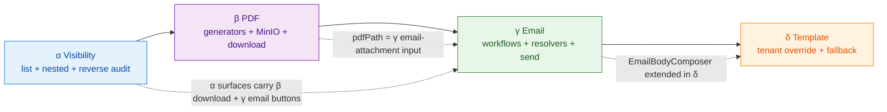
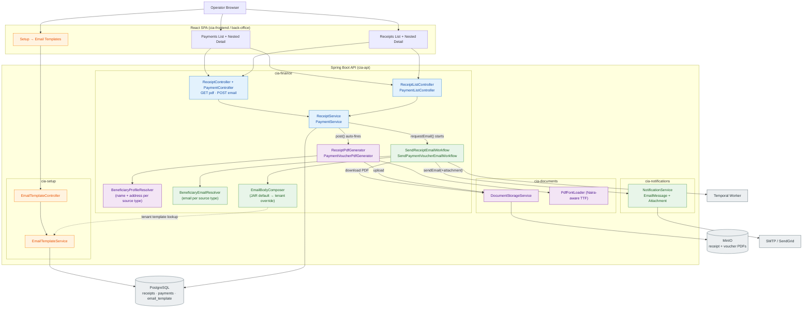

# F7 — Receipt & Payment Visibility, PDF Generation, Email Transmission, and Per-Tenant Email Templates

**Date:** 2026-05-25
**Status:** Approved (brainstorm complete; awaiting user review of this spec, then writing-plans handoff)
**Module:** Finance (Module 8) + Notifications (`cia-notifications`) + Setup (Module 1)
**Backlog row drained:** **F7** (Session 103 follow-up)
**Backlog rows created:** **F9** (delivery tracking), **F10** (partner-API webhook), **R7** (Module 11 data sources)
**Slices:** α (visibility) → β (PDF + MinIO) → γ (email + Temporal) → δ (per-tenant email template override)

---

## Overview

Session 103 (F2) removed the flat "Receipts" and "Payments" sub-sections from `ReceivablesTab` + `PayablesTab` because the backend exposed receipts only nested under debit-notes (`/api/v1/debit-notes/{dnId}/receipts`) and payments only nested under credit-notes. There was no flat-list endpoint, so the UI tabs had nothing to render. The dead `ReverseTransactionDialog.tsx` was left in-tree as a marker of incomplete work.

This design restores cross-DN/CN visibility AND adds two new capabilities the original backlog row did not capture but the brainstorm surfaced as in-scope:

1. **Operators can generate receipts as PDFs for onward transmission to the customer** (the user's stated need: "operators need to see what they have done, even generate the receipts for onward transmission to customer").
2. **Activities are audit-trailed** — who did what, why, when, for both write paths (reverse, send) and visibility paths (visible reversal columns + last-emailed badge).

The work splits into four slices honouring the Session 93 slice-discipline rule (one goal per slice):

| Slice | Goal | Output |
|---|---|---|
| **α** | Make every receipt and payment visible in two surfaces (flat list per Finance sub-module + nested inside DN/CN detail dialogs) with full reversal-audit columns. | Operator cross-DN/CN visibility; reversal audit visible; reverse from any surface. |
| **β** | Auto-generate Receipt + Payment Voucher PDFs on creation; store in MinIO via `DocumentStorageService`; expose download endpoints + buttons. | Manual download path closed. Operator can attach via their own email client. |
| **γ** | Async email transmission via Temporal with retry-until-success; `BeneficiaryEmailResolver` strategy for 4 payment source types; full `SEND` audit per delivery. | Automated transmission closed. Single-button send from any surface. |
| **δ** | Per-tenant `email_template` override for receipt + payment voucher emails with JAR-default fallback. | Per-tenant branding / signature blocks / disclaimers. Optional. JAR defaults serve unchanged-tenant case. |

---

## User needs (from brainstorm Q1–Q3 + scope expansion Q4)

| Need | Slice that closes it |
|---|---|
| Operators need to see what they have done (cross-DN/CN visibility) | α |
| Audit trail — who did what, why, when | α (visible reversal columns) + γ (`SEND` events) |
| Operators need to generate receipts as documents for onward transmission to customer | β (download) + γ (auto-email) |
| Symmetric treatment for receipts AND payments — both directions emailable | γ (`BeneficiaryEmailResolver` dispatches by `CreditNote.sourceType`) |
| Per-tenant branding / signatures / legal disclaimers in transmitted emails | δ |

---

## Architecture overview

Two views, complementary: the **slice-dependency diagram** shows how the 4 slices build on each other (which is the schedule); the **system-architecture diagram** shows the end-state set of components after δ ships and how they wire together at runtime.

### Slice dependency

Solid arrows = strict prerequisite ordering. Dashed arrows = data-flow / abstraction-extension links between non-adjacent slices.



### End-state system architecture

Components colour-coded by the slice that introduces them. Edges are runtime calls.



**Reading the diagram.** An operator click on "Email PDF" on a receipt row flows `ReceiptUI` → `NestedCtrls` → `Services.requestEmail()` → starts `Workflows` (Temporal); the activity calls `EmailComposer` (which optionally hits `TemplateSvc` in δ for a tenant override, otherwise renders JAR default), pulls the PDF bytes from `DocStore` (MinIO), and calls `NotifSvc.sendEmail(...)` which dispatches to `SMTP/SendGrid` with the PDF as an `Attachment`. On success, the activity writes `email_sent_at` + `email_sent_to` back to `Postgres` and audit-logs a `SEND` row.

**Figma version:** the same architecture is also published as an editable FigJam diagram — [F7 — Receipt + Payment Visibility, PDF, Email, Templates (Architecture)](https://www.figma.com/board/dTO6r5EEUfh4WvSiItx8la?utm_source=claude_code&utm_content=edit_in_figjam&architecture=true) (`fileKey: dTO6r5EEUfh4WvSiItx8la`). The mermaid above is the source of truth — the FigJam is a visual mirror you can move/annotate/share.

**Architectural constraints (forced by existing CLAUDE.md conventions):**

- **PDFs live in MinIO** via `DocumentStorageService`. Generation auto-fires on `POSTED`; `pdf_path` persisted on the entity. Reversal does **not** regenerate the PDF — the original is the historical record. Matches the policy/endorsement/claim DV pattern.
- **PDF generation never throws** — `DocumentGenerationService` returns `null` on failure; the calling write path checks for null and proceeds without storage. A receipt is never blocked by PDF failures.
- **Email delivery is Temporal-orchestrated** — `SendReceiptEmailWorkflow` + `SendPaymentVoucherEmailWorkflow` follow the NAICOM-upload pattern: started from a Spring synchronous listener (so `TenantContext` is populated on the request thread), then async activity with retry-until-success.
- **`NotificationService.EmailMessage` gains `List<Attachment> attachments`** — single API change in `cia-notifications`. All three implementations (`Logging`, `SendGrid`, `Smtp`) support attachments natively; existing call-sites pass `null`/empty list and are unaffected.
- **Three Flyway migrations:** V50 (β: `pdf_path`), V51 (γ: `email_sent_at` + `email_sent_to`), V52 (δ: `email_template`). α adds **no** migrations.
- **Cross-module dependency added in δ:** `cia-finance` → `cia-setup` (`EmailBodyComposer` reads `EmailTemplateService`). Acceptable because `cia-setup` is foundational — every business module already depends on it.

---

## Slice α — Visibility

**Goal:** Make every receipt and payment visible in two surfaces (flat list per Finance sub-module + nested inside DN/CN detail dialogs) with full reversal-audit columns. **No PDF, no email.**

### Backend

| File | Action | Detail |
|---|---|---|
| `cia-finance/.../ReceiptListController.java` | new | `@RestController @RequestMapping("/api/v1/receipts")` — separate class from existing nested `ReceiptController`. `GET /api/v1/receipts` with query params (`status`, `createdFrom`, `createdTo`, `paymentMethod`, `debitNoteId`, cursor, limit). Returns `ApiResponse<List<ReceiptListItemResponse>>` with `ApiMeta` carrying `total`/`nextCursor`. `hasAuthority('FINANCE_VIEW')`. |
| `cia-finance/.../PaymentListController.java` | new | Mirror — `@RequestMapping("/api/v1/payments")`. Swap `debitNoteId` for `creditNoteId`. |
| `cia-finance/.../ReceiptRepository.java` | modify | Add `extends JpaSpecificationExecutor<Receipt>`. Existing methods stay. |
| `cia-finance/.../PaymentRepository.java` | modify | Same — add `JpaSpecificationExecutor<Payment>`. |
| `cia-finance/.../ReceiptSpecs.java` | new | Static factory class: `statusEquals(TransactionStatus)`, `createdBetween(Instant, Instant)`, `paymentMethodEquals(...)`, `debitNoteIdEquals(UUID)`, `deletedAtIsNull()`. Composes via `Specification.where(...).and(...)`. |
| `cia-finance/.../PaymentSpecs.java` | new | Mirror. |
| `cia-finance/.../ReceiptService.java` | modify | New method `Page<Receipt> findAll(Specification<Receipt>, Pageable)`. Inside `reverse(...)`, **verify** existing call invokes `AuditService.log(...)` with `action=REVERSE`. If not, add it. |
| `cia-finance/.../PaymentService.java` | modify | Same — new `findAll`; verify+fix `reverse` audit log. |
| `cia-finance/.../ReceiptListItemResponse.java` | new | Projection DTO: `id`, `reference`, `debitNoteId`, `debitNoteNumber`, `policyNumber?`, `customerName`, `amount`, `paymentMethod`, `paymentDate`, `status`, `reversedAt?`, `reversedBy?`, `reversalReason?`, `createdAt`. Built via JPQL constructor expression to avoid N+1. |
| `cia-finance/.../PaymentListItemResponse.java` | new | Mirror. Adds `beneficiaryType` (= `CreditNote.sourceType`) + `beneficiaryReference` for flat-list display. |
| `cia-finance/src/test/.../ReceiptListControllerIT.java` | new | 5 tests: happy path (paged + filtered by date), `status=POSTED` excludes REVERSED, `debitNoteId` filter, role gating (403 without `FINANCE_VIEW`), tenant isolation. |
| `cia-finance/src/test/.../PaymentListControllerIT.java` | new | Mirror — 5 tests. |
| `cia-finance/src/test/.../ReceiptReverseAuditIT.java` | new | 1 test: `reverse(...)` ⇒ `AuditLog` table gets one row with `action=REVERSE`, `entity_type=Receipt`, snapshot fields populated. |
| `cia-finance/src/test/.../PaymentReverseAuditIT.java` | new | Mirror. |

### Frontend

| File | Action | Detail |
|---|---|---|
| `packages/api-client/src/modules/finance.ts` | modify | Add `receiptListItemResponseSchema` + `paymentListItemResponseSchema` (zod) field-for-field with backend DTOs. Add `listReceipts(filters)` / `listPayments(filters)` via `validatedGet`. DTO-drift script stays green. |
| `apps/back-office/src/modules/finance/pages/receivables/ReceiptsListSection.tsx` | new | Flat list page mounted under the "Receipts" sub-tab. `<DataTable>` from `@cia/ui` with TanStack column defs. Filter bar: status select, date-range picker, payment-method select. Row action: "Reverse" (gated on `status=POSTED` + `FINANCE_UPDATE`). |
| `apps/back-office/src/modules/finance/pages/receivables/ReceivablesTab.tsx` | modify | Wrap current debit-notes table in `<Tabs>` with two `<TabsTrigger>`: "Debit Notes" (existing) + "Receipts" (new — renders `<ReceiptsListSection>`). |
| `apps/back-office/src/modules/finance/pages/payables/PaymentsListSection.tsx` | new | Mirror of `ReceiptsListSection`. Extra column: beneficiary label (e.g., "Claim DV CLM-001234"). |
| `apps/back-office/src/modules/finance/pages/payables/PayablesTab.tsx` | modify | Wrap in `<Tabs>` — "Credit Notes" + "Payments". |
| `apps/back-office/src/modules/finance/dialogs/DebitNoteDetailDialog.tsx` | modify | Add "Receipts" section below summary block. Inline `<DataTable>` listing receipts for this DN. Row action: "Reverse" → opens `ReverseTransactionDialog`. |
| `apps/back-office/src/modules/finance/dialogs/CreditNoteDetailDialog.tsx` | modify | Mirror — "Payments" section. |
| `apps/back-office/src/modules/finance/dialogs/ReverseTransactionDialog.tsx` | wire in | File exists. Import + render from all 4 surfaces. On success, invalidate query keys `['receipts']`, `['payments']`, `['debitNote', dnId, 'receipts']`, `['creditNote', cnId, 'payments']`. |
| `apps/back-office/src/modules/finance/hooks/useReceipts.ts` | new | `useQuery<ReceiptListItemResponse[]>` against `listReceipts(filters)`. Plus `useReverseReceipt()` mutation. |
| `apps/back-office/src/modules/finance/hooks/usePayments.ts` | new | Mirror. |

**α counts:** ~14 backend (11 new + 3 modified, 4 ITs) + ~9 frontend (4 new + 5 modified). No migrations.

---

## Slice β — PDF generation + MinIO storage + download surfaces

**Goal:** auto-generate Receipt PDFs on receipt post + Payment Voucher PDFs on payment post; store in MinIO; expose `GET .../{id}/pdf` + Download button on every receipt/payment surface from α. **No email.**

### Backend

| File | Action | Detail |
|---|---|---|
| `cia-api/.../db/migration/V50__add_pdf_path_to_receipts_payments.sql` | new | `ALTER TABLE receipts ADD COLUMN pdf_path VARCHAR(512)` + same on `payments`. Nullable. No indexes. |
| `cia-finance/.../Receipt.java` | modify | Add `@Column(name="pdf_path") String pdfPath`. |
| `cia-finance/.../Payment.java` | modify | Same. |
| `cia-documents/src/main/resources/fonts/NotoSans-Regular.ttf` | new | Open Font License font with the ₦ glyph (U+20A6). ~580 KB binary. |
| `cia-documents/.../pdf/PdfFontLoader.java` | new | Static helper: `loadBodyFont(PDDocument doc) → PDType0Font`. Loads `/fonts/NotoSans-Regular.ttf`. Shared utility — `ReceiptPdfGenerator` + `PaymentVoucherPdfGenerator` consume it. Existing PDF generators may adopt it incrementally per the pre-existing CLAUDE.md "Phase 4 v2 — PDF Naira-glyph TTF embedding" note. β does not modify those generators. |
| `cia-documents/src/main/resources/templates/receipt-default.html` | new | Thymeleaf template. Header (company name + logo placeholder), title "OFFICIAL RECEIPT", reference, date, "Received from" (customer name + address), amount in figures (with ₦) + amount in words, payment method, related DN number, related policy number (if DN is policy-backed), "Being payment for" narrative, signatory placeholder. |
| `cia-documents/src/main/resources/templates/payment-voucher-default.html` | new | Same shape. Title "PAYMENT VOUCHER". "Paid to" resolves per `CreditNote.sourceType`. Two signatory placeholders (vouchers conventionally need two signatures). |
| `cia-finance/.../pdf/ReceiptPdfGenerator.java` | new | Interface impl `byte[] generate(Receipt)`. Apache PDFBox 3.x + `@Bean("documentTemplateEngine")` Thymeleaf engine. **Never throws** — catches `Exception`, logs at WARN, returns `null`. |
| `cia-finance/.../pdf/PaymentVoucherPdfGenerator.java` | new | Mirror. Constructor takes `TemplateEngine`, `CreditNoteRepository`, `BeneficiaryProfileResolver`. |
| `cia-finance/.../pdf/BeneficiaryProfileResolver.java` | new | Strategy interface: `BeneficiaryProfile resolve(CreditNote)` → `(name, address)`. Implementations: `ClaimDvBeneficiaryProfileResolver`, `CommissionBeneficiaryProfileResolver`, `FacOutwardBeneficiaryProfileResolver`, `EndorsementRefundBeneficiaryProfileResolver`. Dispatched via `BeneficiaryProfileResolverDispatcher` keyed on `CreditNote.SourceType`. |
| `cia-finance/.../ReceiptService.java` | modify | After successful `receiptRepository.save(...)` in `post(...)`, call `pdfGenerator.generate(receipt)` → if non-null, `documentStorageService.upload(...)` → set `receipt.pdfPath`, save again. If null, leave `pdfPath=null` and log. Order: PDF after audit log so audit captures pre-PDF state. |
| `cia-finance/.../PaymentService.java` | modify | Mirror. |
| `cia-finance/.../ReceiptController.java` | modify | Add `GET /api/v1/debit-notes/{dnId}/receipts/{id}/pdf`. `hasAuthority('FINANCE_VIEW')`; 404 if `pdfPath IS NULL`; streams via `documentStorageService.download(...)` as `application/pdf` with `Content-Disposition: attachment; filename="REC-<ref>.pdf"`. |
| `cia-finance/.../PaymentController.java` | modify | Add `GET /api/v1/credit-notes/{cnId}/payments/{id}/pdf`. Same shape; filename `PAY-<ref>.pdf`. |
| `cia-finance/src/test/.../pdf/ReceiptPdfGeneratorIT.java` | new | 4 tests: non-null bytes from full receipt + `PDDocument.load` parses cleanly; PDF text contains reference + amount + customer name; ₦ byte sequence (U+20A6) present in PDF stream; generator returns null cleanly when `CustomerRepository.findById` empty. |
| `cia-finance/src/test/.../pdf/PaymentVoucherPdfGeneratorIT.java` | new | 4 tests — happy path per `CreditNote.sourceType` (CLAIM_DV / COMMISSION / FAC_OUTWARD / ENDORSEMENT_REFUND). |
| `cia-finance/src/test/.../ReceiptControllerPdfIT.java` | new | 4 tests: POST receipt → `pdf_path` populated + MinIO has object; GET pdf → 200 + `application/pdf` + non-empty body; GET on null `pdfPath` → 404; role gating. |
| `cia-finance/src/test/.../PaymentControllerPdfIT.java` | new | Mirror — 4 tests. |

### Frontend

| File | Action | Detail |
|---|---|---|
| `packages/api-client/src/modules/finance.ts` | modify | `receiptListItemResponseSchema` + `paymentListItemResponseSchema` gain `pdfPath: z.string().nullable()`. Add `downloadReceiptPdf(dnId, receiptId)` / `downloadPaymentPdf(cnId, paymentId)` blob fetchers via `apiClient.get(url, { responseType: 'blob' })` — same pattern as F5.16 NAICOM artifacts. |
| `apps/back-office/src/modules/finance/hooks/useReceipts.ts` | modify | Add `useDownloadReceiptPdf()` mutation. Synthesizes filename from receipt reference; triggers browser download via `createObjectURL` + anchor click. |
| `apps/back-office/src/modules/finance/hooks/usePayments.ts` | modify | Mirror. |
| `apps/back-office/src/modules/finance/pages/receivables/ReceiptsListSection.tsx` | modify | Add "Download PDF" row action. Disabled (tooltip "PDF unavailable") when `pdfPath === null`. Spinner state keyed on receipt id (matches F5.16 pattern). |
| `apps/back-office/src/modules/finance/pages/payables/PaymentsListSection.tsx` | modify | Mirror. |
| `apps/back-office/src/modules/finance/dialogs/DebitNoteDetailDialog.tsx` | modify | "Download PDF" action on each row of nested receipts list. |
| `apps/back-office/src/modules/finance/dialogs/CreditNoteDetailDialog.tsx` | modify | Mirror. |

**β counts:** ~14 backend (10 new + 4 modified, 4 ITs) + ~7 frontend (1 binary + 6 modified). One Flyway migration (V50).

---

## Slice γ — Email transmission + Temporal + audit + EmailBodyComposer + JAR-default templates

**Goal:** Operator presses "Email" on any receipt/payment row → PDF (from β) delivered to resolved recipient via SMTP with retry-until-success + full audit. Manual trigger only. **No tenant template override** (that's δ).

### Backend — `cia-notifications` API extension (one-shot infrastructure)

| File | Action | Detail |
|---|---|---|
| `cia-notifications/.../Attachment.java` | new | `record Attachment(String filename, String contentType, byte[] content)`. |
| `cia-notifications/.../EmailMessage.java` | modify | Add `List<Attachment> attachments`. Preserve backward compatibility — if Lombok `@Builder`, add `@Builder.Default List<Attachment> attachments = List.of()`. If record, add canonical-constructor field + provide `EmailMessage.of(to, subject, body)` static factory defaulting attachments to `List.of()`. All existing call-sites must continue compiling unchanged. |
| `cia-notifications/.../LoggingEmailService.java` | modify | Log filename + contentType + content.length at INFO. |
| `cia-notifications/.../SendGridEmailService.java` | modify | SendGrid SDK natively supports attachments — base64 + filename + type. |
| `cia-notifications/.../SmtpEmailService.java` | modify | JavaMail `MimeMultipart`: first part HTML body, subsequent parts `MimeBodyPart` per attachment. |
| `cia-notifications/src/test/.../EmailMessageAttachmentIT.java` | new | 3 tests: Logging logs metadata; Smtp builds valid `MimeMultipart` (via greenmail); `EmailMessage.of(...)` legacy factory returns empty attachments. |

### Backend — `cia-finance` email machinery

| File | Action | Detail |
|---|---|---|
| `cia-api/.../db/migration/V51__add_email_tracking_to_receipts_payments.sql` | new | `ALTER TABLE receipts ADD COLUMN email_sent_at TIMESTAMPTZ` + `email_sent_to VARCHAR(255)`. Same on `payments`. Nullable, no indexes. |
| `cia-finance/.../Receipt.java` | modify | Add `emailSentAt: Instant?` + `emailSentTo: String?`. |
| `cia-finance/.../Payment.java` | modify | Same. |
| `cia-finance/.../email/BeneficiaryEmailResolver.java` | new | Strategy interface: `Optional<String> resolve(CreditNote)`. Parallel to β's `BeneficiaryProfileResolver` but returns email only. |
| `cia-finance/.../email/ClaimDvBeneficiaryEmailResolver.java` | new | Loads claim → `claim.claimantEmail`. |
| `cia-finance/.../email/CommissionBeneficiaryEmailResolver.java` | new | Routes per `CommissionRecipient` discriminator (broker vs agent) → broker.email / agent.email. |
| `cia-finance/.../email/FacOutwardBeneficiaryEmailResolver.java` | new | Loads reinsurer → reinsurer.email. |
| `cia-finance/.../email/EndorsementRefundBeneficiaryEmailResolver.java` | new | Loads endorsement → endorsement.policy.customer.email. |
| `cia-finance/.../email/BeneficiaryEmailResolverDispatcher.java` | new | Maps `CreditNote.SourceType → BeneficiaryEmailResolver` via Spring `Map<SourceType, BeneficiaryEmailResolver>` autowire. Method: `Optional<String> resolve(CreditNote)`. |
| `cia-common/.../email/EmailTemplateType.java` | new | Enum in `cia-common` (not `cia-setup`, not `cia-finance`) so both modules can reference it without a cross-business-module dependency. Values: `RECEIPT_EMAIL`, `PAYMENT_VOUCHER_EMAIL`. γ creates this enum; δ uses the existing one. |
| `cia-finance/.../email/EmailBodyComposer.java` | new | Service: `EmailContent compose(EmailTemplateType type, Map<String, Object> mergeFields)` → `EmailContent(subject, bodyHtml)`. Reads JAR-default Thymeleaf template (`/templates/email/<type>-default.html`); renders via `@Bean("documentTemplateEngine")`. **No DB lookup in γ.** δ extends to check tenant `email_template` first. |
| `cia-documents/src/main/resources/templates/email/receipt-default.html` | new | JAR-default email body for receipts. Merge fields: `${customerName}`, `${receiptNumber}`, `${amount}`, `${paymentDate}`, `${debitNoteNumber}`, `${companyName}`. |
| `cia-documents/src/main/resources/templates/email/payment-voucher-default.html` | new | Same shape for vouchers. Merge fields include `${beneficiaryName}`, `${paymentNumber}`, `${amount}`, `${paymentDate}`, `${creditNoteNumber}`. |
| `cia-finance/.../email/SendReceiptEmailWorkflow.java` | new | Temporal workflow interface + impl. Input: `(tenantId, receiptId, requestedBy)`. Single activity. Retry policy: exponential 5min → 15min → 1hr → indefinite (matches NAICOM upload). |
| `cia-finance/.../email/SendReceiptEmailActivity.java` | new | Steps: (1) `TenantContext.set(tenantId)`; (2) load receipt; (3) if `pdfPath == null` → `ApplicationFailure.newNonRetryableFailure(RECEIPT_PDF_UNAVAILABLE)`; (4) resolve recipient = `receipt.debitNote.policy.customer.email` (Optional.empty → `RECEIPT_RECIPIENT_UNRESOLVED`); (5) `documentStorageService.download(pdfPath)` → bytes; (6) `emailBodyComposer.compose(RECEIPT_EMAIL, mergeFields)` → subject + body; (7) `EmailMessage.builder()...attachments(List.of(new Attachment(...))).build()`; (8) `notificationService.sendEmail(...)` — SMTP failures bubble for Temporal retry; (9) on success: direct `UPDATE receipts SET email_sent_at = NOW(), email_sent_to = ? WHERE id = ?` via `JdbcTemplate` (avoids JPA cascade); (10) `AuditService.log(action=SEND, ...)`; (11) `TenantContext.clear()` + `FiscalPeriodLookupCache.clearThreadCache()` (per Slice 1.7 cache rule). |
| `cia-finance/.../email/SendPaymentVoucherEmailWorkflow.java` | new | Mirror — recipient via `BeneficiaryEmailResolverDispatcher.resolve(payment.creditNote)`. |
| `cia-finance/.../email/SendPaymentVoucherEmailActivity.java` | new | Mirror activity. |
| `cia-finance/.../email/PaymentEmailWorkerRegistration.java` | new | `@PostConstruct` bean that registers both workflows + activities on the Temporal `WorkerFactory`. `cia-api`'s `TemporalWorkerStarter` calls `factory.start()` after all module workers register. |
| `cia-finance/.../ReceiptService.java` | modify | New method `String requestEmail(UUID receiptId)`. Validates `pdfPath != null` (→ 422 `RECEIPT_PDF_UNAVAILABLE`) + customer email present (→ 422 `RECEIPT_RECIPIENT_UNRESOLVED`); starts `SendReceiptEmailWorkflow`; returns workflow id. |
| `cia-finance/.../PaymentService.java` | modify | Mirror — uses dispatcher for recipient check before workflow start. |
| `cia-finance/.../ReceiptController.java` | modify | Add `POST /api/v1/debit-notes/{dnId}/receipts/{id}/email`. `hasAuthority('FINANCE_UPDATE')`. Returns 202 with `{ workflowId: "..." }` or 422 with structured error code. |
| `cia-finance/.../PaymentController.java` | modify | Mirror — `POST /api/v1/credit-notes/{cnId}/payments/{id}/email`. |
| `cia-finance/.../ReceiptListItemResponse.java` | modify | Add `recipientEmail: String?` (= `debitNote.policy.customer.email`) + `emailSentAt: Instant?` + `emailSentTo: String?`. |
| `cia-finance/.../PaymentListItemResponse.java` | modify | Add `recipientEmail` (pre-resolved server-side via dispatcher) + `emailSentAt` + `emailSentTo`. **Implementation note:** the dispatcher is invoked per-payment when building the list response — for a 50-row page, that's ~50 + ~200 small ID-based FK lookups (claim → claimant, broker by id, agent by id, reinsurer by id, endorsement → policy → customer). Acceptable for v1; if a real performance concern surfaces, switch to a batch resolver (`Map<UUID, String> resolveAll(List<CreditNote>)`) — same interface shape, single multi-key query per source-type group. |

### Backend — ITs

| File | Action | Detail |
|---|---|---|
| `cia-finance/src/test/.../email/BeneficiaryEmailResolverDispatcherIT.java` | new | 4 tests — one per source type — plus 1 `Optional.empty()` failure. |
| `cia-finance/src/test/.../email/SendReceiptEmailWorkflowIT.java` | new | Temporal test framework. 3 tests: happy path (`email_sent_at`/`email_sent_to` populated + `AuditLog` SEND row); `pdfPath==null` → workflow fails non-retryably; SMTP failure → retry sim (3 fails + 1 success = 1 SEND audit row, not 4). |
| `cia-finance/src/test/.../email/SendPaymentVoucherEmailWorkflowIT.java` | new | 6 tests — 4 happy paths per source type, 1 unresolved recipient, 1 retry sim. |
| `cia-finance/src/test/.../email/ReceiptControllerEmailIT.java` | new | 3 tests: 202 happy; 422 `RECEIPT_PDF_UNAVAILABLE`; 422 `RECEIPT_RECIPIENT_UNRESOLVED`; plus role gating. |
| `cia-finance/src/test/.../email/PaymentControllerEmailIT.java` | new | Mirror — 3 tests + role gating. |

### Frontend

| File | Action | Detail |
|---|---|---|
| `packages/api-client/src/modules/finance.ts` | modify | `receiptListItemResponseSchema` + `paymentListItemResponseSchema` gain `recipientEmail: z.email().nullable()` + `emailSentAt: z.string().datetime().nullable()` + `emailSentTo: z.string().nullable()`. Add `emailReceipt(...)` / `emailPayment(...)` via `validatedPost`. |
| `apps/back-office/src/modules/finance/hooks/useReceipts.ts` | modify | Add `useEmailReceipt()` mutation. Success toast; 422 toast on error code. |
| `apps/back-office/src/modules/finance/hooks/usePayments.ts` | modify | Mirror. |
| `apps/back-office/src/modules/finance/dialogs/EmailConfirmDialog.tsx` | new | Shared confirmation dialog. Props: `{ open, recipientEmail, documentLabel, onConfirm, onCancel }`. Renders "Email <documentLabel> to <recipientEmail>?" with Cancel + Send buttons. |
| `apps/back-office/src/modules/finance/pages/receivables/ReceiptsListSection.tsx` | modify | "Email PDF" row action. Disabled with tooltip "PDF unavailable" when `pdfPath===null`, "No customer email on file" when `recipientEmail===null`. Opens `EmailConfirmDialog`. "Last emailed" badge updates after success. |
| `apps/back-office/src/modules/finance/pages/payables/PaymentsListSection.tsx` | modify | Mirror. |
| `apps/back-office/src/modules/finance/dialogs/DebitNoteDetailDialog.tsx` | modify | "Email PDF" row action on each nested receipt. |
| `apps/back-office/src/modules/finance/dialogs/CreditNoteDetailDialog.tsx` | modify | Mirror. |

**γ counts:** ~25 backend (16 new + 9 modified, 5 ITs) + ~8 frontend (1 new + 7 modified). One Flyway migration (V51).

---

## Slice δ — Per-tenant email template override

**Goal:** Tenant System Admin uploads custom subject + body templates per document type (RECEIPT_EMAIL / PAYMENT_VOUCHER_EMAIL); `EmailBodyComposer` reads tenant template first, falls back to JAR default. **Optional — JAR defaults serve unchanged-tenant case unchanged.**

### Backend

| File | Action | Detail |
|---|---|---|
| `cia-api/.../db/migration/V52__create_email_template.sql` | new | `email_template` table: `id UUID PK`, `template_type VARCHAR NOT NULL CHECK (template_type IN ('RECEIPT_EMAIL', 'PAYMENT_VOUCHER_EMAIL'))`, `subject_template TEXT NOT NULL`, `body_html_template TEXT NOT NULL`, `updated_at TIMESTAMPTZ`, `updated_by VARCHAR`, `deleted_at TIMESTAMPTZ`. Partial unique index `UNIQUE(template_type) WHERE deleted_at IS NULL`. |
| `cia-setup/.../email/EmailTemplate.java` | new | JPA entity extending `BaseEntity`. Uses the existing `EmailTemplateType` enum from `cia-common` (created in γ). |
| `cia-setup/.../email/EmailTemplateRepository.java` | new | `findByTemplateTypeAndDeletedAtIsNull(EmailTemplateType)`. |
| `cia-setup/.../email/EmailTemplateService.java` | new | `findByType(...)` Optional; `upsert(type, subject, bodyHtml)` (soft-delete prior + insert — Type-2 SCD); `revertToDefault(type)` (soft-delete only). All writes audit-logged. |
| `cia-setup/.../email/EmailTemplateController.java` | new | `GET /api/v1/setup/email-templates` (list both types — includes null entries for un-customized types), `GET /api/v1/setup/email-templates/{type}`, `PUT /api/v1/setup/email-templates/{type}` (upsert), `DELETE /api/v1/setup/email-templates/{type}` (revert), `POST /api/v1/setup/email-templates/{type}/preview` (render-only, no persist). `hasAuthority('SETUP_TEMPLATES_MANAGE')`. |
| `cia-finance/.../email/EmailBodyComposer.java` | modify | Inject `EmailTemplateService` from cia-setup. Lookup `tenantTemplate = emailTemplateService.findByType(type)`. If present, render its `subject_template` + `body_html_template`. If absent, fall back to JAR default. Introduces `cia-finance` → `cia-setup` dependency (acceptable — `cia-setup` is foundational). |
| `cia-setup/src/test/.../email/EmailTemplateControllerIT.java` | new | 4 tests: GET happy (both types, no overrides → null bodies); PUT creates; PUT-after-existing creates new + soft-deletes prior; DELETE soft-deletes active; role gating. |
| `cia-setup/src/test/.../email/EmailTemplateServiceIT.java` | new | 2 tests: upsert preserves prior via soft-delete (Type-2 SCD audit); revertToDefault soft-deletes without insert. |
| `cia-finance/src/test/.../email/EmailBodyComposerWithTenantTemplateIT.java` | new | 3 tests: tenant template overrides JAR default; absent template uses JAR default; merge fields resolve in both paths. |
| `cia-finance/src/test/.../email/SendReceiptEmailWorkflowIT.java` | modify γ IT | One additional assertion in existing happy-path test: tenant template (when present) renders into email subject + body. No new file. |

### Frontend

| File | Action | Detail |
|---|---|---|
| `packages/api-client/src/modules/setup.ts` | modify | Add `emailTemplateSchema` (zod) + `listEmailTemplates()`, `getEmailTemplate(type)`, `upsertEmailTemplate(type, body)`, `revertEmailTemplate(type)`, `previewEmailTemplate(type, body)` via validated client. |
| `apps/back-office/src/modules/setup/pages/EmailTemplatesPage.tsx` | new | Two-tab page (one per type). Each tab: subject input, body `<TextArea>` (plain HTML allowed; rich editor explicitly out of scope), merge-field reference (e.g., "Available: `${customerName}`, `${receiptNumber}`, ..."), Preview button (POSTs body → renders returned HTML in preview pane), Save + Revert-to-default actions. |
| `apps/back-office/src/modules/setup/SetupPage.tsx` | modify | Add "Email Templates" sub-tab alongside existing Setup tabs. |
| `apps/back-office/src/modules/setup/hooks/useEmailTemplates.ts` | new | `useQuery` + 3 mutations (upsert, revert, preview). |

**δ counts:** ~13 backend (9 new + 4 modified, 4 ITs) + ~4 frontend (2 new + 2 modified). One Flyway migration (V52).

---

## Cross-cutting concerns

### Error handling matrix

| Slice | Status | Code | Trigger | Frontend reaction |
|---|---|---|---|---|
| α | 403 | (Spring default) | Missing `FINANCE_VIEW` | Access-denied page |
| α | 400 | `INVALID_FILTER_DATE` / `INVALID_FILTER_STATUS` | Bad query-param parse | Inline form error |
| α | 404 | `RECEIPT_NOT_FOUND` / `PAYMENT_NOT_FOUND` | Direct fetch by id | Toast + close detail dialog |
| β | 404 | `RECEIPT_PDF_NOT_GENERATED` / `PAYMENT_PDF_NOT_GENERATED` | `GET .../{id}/pdf` when `pdfPath IS NULL` | Toast "PDF was never generated. Contact admin." |
| β | 403 | (Spring default) | Missing `FINANCE_VIEW` for GET PDF | Disable download button |
| γ | 202 | — | Workflow started | Toast "Email queued — REC-001 will be sent to john@acme.com" |
| γ | 422 | `RECEIPT_PDF_UNAVAILABLE` / `PAYMENT_PDF_UNAVAILABLE` | `pdfPath IS NULL` precondition | Toast "Cannot email — PDF was never generated." |
| γ | 422 | `RECEIPT_RECIPIENT_UNRESOLVED` / `PAYMENT_RECIPIENT_UNRESOLVED` | Recipient email is null | Toast "Cannot email — no email on file. Update the record first." |
| γ | 403 | (Spring default) | Missing `FINANCE_UPDATE` for POST email | Disable email button |
| γ | (Temporal) | `ApplicationFailure(<code>)` | Activity fails inside workflow | Non-retryable; workflow ends FAILED; Temporal UI |
| γ | (Temporal) | Transient SMTP exception | Activity throws normal `Exception` | Retryable per 5min → 15min → 1hr → indefinite backoff |
| δ | 403 | (Spring default) | Missing `SETUP_TEMPLATES_MANAGE` | Access-denied page |
| δ | 400 | `INVALID_TEMPLATE_TYPE` | Path `{type}` not in enum | Inline error |
| δ | 422 | `TEMPLATE_RENDER_FAILED` | Preview request body Thymeleaf-invalid | Inline error on preview pane |

### Test count summary

Counts are approximate — exact numbers firm up during writing-plans / implementation. Each row reflects the test files described in that slice's section.

| Slice | New ITs (approx) | New unit tests (approx) | Approx total |
|---|---|---|---|
| α | ~12 (5 ReceiptList + 5 PaymentList + 1 Receipt reverse-audit + 1 Payment reverse-audit) | ~4 (`*Specs` static helpers) | ~16 |
| β | ~16 (4 ReceiptPdfGenerator + 4 PaymentVoucherPdfGenerator + 4 ReceiptControllerPdf + 4 PaymentControllerPdf) | ~2 (`PdfFontLoader`) | ~18 |
| γ | ~25 (5 dispatcher + 3 receipt-workflow + 6 payment-workflow + 4 receipt-controller-email + 4 payment-controller-email + 3 attachment) | ~6 (4 resolver impls + 2 EmailMessage shape) | ~31 |
| δ | ~9 (4 EmailTemplateController + 2 EmailTemplateService + 3 EmailBodyComposer-with-tenant-template; plus 1 assertion appended to an existing γ workflow IT — no new file) | ~2 (service-layer unit) | ~11 |
| **Total** | **~62 ITs** | **~14 units** | **~76 tests** |

Each slice's verification:
- `mvn install -DskipTests -pl cia-api -am` clean
- `mvn -pl <touched-module> verify` zero regression
- `mvn verify` from reactor root — existing 274 cia-api failsafe baseline must remain at 274 + new IT delta with 0 failures / 0 errors / 1 intentional benchmark skip
- `pnpm --filter @cia/back-office typecheck` exits 0
- `check-dto-drift.mjs` exits 0
- `check-api-wiring.sh` exits 0

### Audit posture summary

| Slice | Action | Old value | New value |
|---|---|---|---|
| α (verify-and-fix) | `REVERSE` on Receipt/Payment | `{ status: POSTED, reversedAt: null, reversedBy: null, reversalReason: null }` | `{ status: REVERSED, reversedAt: <ts>, reversedBy: <user>, reversalReason: <reason> }` |
| β | (none new) | — | — |
| γ | `SEND` on Receipt/Payment | `{ email_sent_at: <previous or null>, email_sent_to: <previous or null> }` | `{ email_sent_at: <ts>, email_sent_to: <recipient> }` |
| δ | `UPDATE` / `DELETE` on EmailTemplate | template body snapshot | new body snapshot or null |

Re-email (γ) emits a fresh `SEND` row per send — full chronological history in `audit_log`; `receipts.email_sent_at` / `email_sent_to` always reflect latest send.

### Tenant-context posture (γ Temporal activities)

Workflow input carries `tenantId`. Activity sets `TenantContext` from input, clears it at end, and clears `FiscalPeriodLookupCache.clearThreadCache()` per CLAUDE.md Slice 1.7 rule for non-HTTP callers on pooled threads.

### CLAUDE.md updates per slice

| Slice | CLAUDE.md edits |
|---|---|
| α | Module 8 Finance feature description; Frontend Build Queue Build 6 sub-page descriptions (Receipts/Payments sub-tabs restored); new Development Conventions bullet for separate `*ListController` per child aggregate. |
| β | Module 8 feature description; Data Model Highlights (`receipts` + `payments` gain `pdf_path`); Development Conventions bullet for `PdfFontLoader` shared utility; Frontend Build Queue update for PDF download buttons. |
| γ | Module 8 feature description; Data Model Highlights (`email_sent_at` + `email_sent_to`); Section 11 `NotificationService` signature update (`EmailMessage` now carries `List<Attachment>`); Development Conventions bullet for dual-resolver pattern + Temporal email workflow pattern; Frontend Build Queue update for Email PDF row action. |
| δ | Module 1 Setup feature count (+1: email template management); Data Model Highlights (new `email_template` table); Development Conventions bullet for tenant template + JAR-default fallback pattern; Frontend Build Queue Build 2 (Setup) sub-page list gains "Email Templates". |

### Docs-site updates per slice (per /cia gate #9)

| Slice | `internal-api.json` paths to add | Other docs-site files |
|---|---|---|
| α | `/receipts` (GET), `/payments` (GET) | — |
| β | `/debit-notes/{dnId}/receipts/{id}/pdf` (GET), `/credit-notes/{cnId}/payments/{id}/pdf` (GET) | `database-migrations.md` — V50. |
| γ | `/debit-notes/{dnId}/receipts/{id}/email` (POST), `/credit-notes/{cnId}/payments/{id}/email` (POST) | `database-migrations.md` — V51. `modules.md` — `cia-notifications` `EmailMessage` shape change. |
| δ | `/setup/email-templates` (GET), `/setup/email-templates/{type}` (GET/PUT/DELETE), `/setup/email-templates/{type}/preview` (POST) | `database-migrations.md` — V52. |

---

## Locked design choices

These are positive design decisions locked during the brainstorm — not gaps, not deferrals:

1. **Re-email is permitted.** No cooldown, no guard. Each send writes a fresh `SEND` audit row; `email_sent_at` reflects latest send. Operators legitimately resend when customers report non-receipt.
2. **Email is manual-trigger only.** No auto-fire on receipt/payment creation. Operators retain final say before customer transmission.
3. **PDF preview is download-only.** No iframe preview in detail dialog. YAGNI.
4. **Symmetric receipt + payment-voucher email paths.** Both directions emailable; payment-voucher recipient resolves via `BeneficiaryEmailResolver` dispatched on `CreditNote.sourceType` (4 source types).
5. **PDFs in MinIO, never regenerated on reversal.** Original PDF is the historical record. Matches policy/endorsement/claim DV pattern.
6. **EmailBodyComposer abstraction from γ onward.** γ ships with JAR-default templates; δ extends the composer with a tenant-template DB lookup. The abstraction is intentional — δ becomes a clean append, not a retrofit.
7. **Plain HTML email body editor in δ.** No rich text editor. Operators paste/edit HTML directly with merge-field references visible.

---

## Out-of-bounds (genuine scope caps — none are deferred reviewer findings)

Each item below is **not in the design** because no user need surfaced for it during the brainstorm. None are reviewer findings being pushed forward.

| Item | Why not in design |
|---|---|
| Bulk email ("email all this week's receipts in one click") | Never requested. Operator workflow is single-receipt-at-a-time. |
| Rich text email body editor | No surface need stated. Plain HTML covers v1. |
| Existing PDF generators (policy / endorsement / claim DV / NAICOM artifacts) adopting `PdfFontLoader` | The CLAUDE.md "Phase 4 v2 — PDF Naira-glyph TTF embedding" note **pre-dates** this work and already authorizes incremental adoption. β surfaces nothing new about those generators — it introduces the shared utility they may later consume. |

---

## Backlog rows to add (per user instruction)

After this design doc commits, the following rows are added to the canonical backlog at the top of `cia-log.md`:

| ID | P | Item | Notes |
|---|---|---|---|
| **F9** | P2 | Email delivery / bounce tracking via SendGrid event webhook | `email_sent_at` currently means "handed to SMTP". Auditors will eventually ask "was REC-007 actually delivered?" — bounces are silent today. Adds `email_delivery_log` (Type-2 SCD), SendGrid event webhook endpoint with signature verification, asynchronous bounce-status updates, frontend "Delivered ✓ / Bounced ✗" badge per row. Conditional on `NOTIFICATION_EMAIL_PROVIDER=sendgrid` — SMTP impl can't deliver bounce signals. ~15 files. |
| **F10** | P3 | Partner API webhook events `partner.receipt_emailed` + `partner.payment_emailed` | Insurtechs that build their own dashboards want the event so they can show "Receipt sent to your customer at <time>". γ's `SendReceiptEmailActivity` already publishes `ReceiptEmailedEvent` (Spring `ApplicationEvent`) — partner-api adds an `@EventListener` that fans out to registered webhooks via the existing Temporal webhook-dispatch workflow. ~4 files in `cia-partner-api`, zero in `cia-finance`. |
| **R7** | P3 | "Receipts" + "Payments" as Module 11 data sources | Pure Module 11 work: add `RECEIPT` + `PAYMENT` to `DataSource` enum, 2 `BASE_QUERIES` entries in `ReportQueryBuilder`, ~4 new SYSTEM report definitions in a Flyway data migration (V45+). Pick up when next touching Module 11. |

---

## Slice ordering rationale

```
α visibility            β PDF                       γ email                   δ tenant template
  │                       │                           │                          │
  │ surfaces become        │ produces pdfPath which   │ uses EmailBodyComposer    │ extends composer
  │ carriers for β + γ    │ is γ's precondition      │ with JAR defaults +        │ with tenant-DB
  │                       │                           │   delivers via Temporal    │ lookup ahead of JAR
  └──────────────────────→┴──────────────────────────→┴───────────────────────────→┘
```

Each slice ships independently useful:

| After | Operator capability gained |
|---|---|
| α | Cross-DN/CN visibility ("see what I did"); reversal audit visible; reverse from any surface. |
| β | Manual PDF download — operator attaches PDF to email via their own client. |
| γ | Automated email transmission with retry; full audit; symmetric receipt + payment paths. |
| δ | Per-tenant branding / signatures / disclaimers customise the transmitted email body. |

δ is purely additive — tenants who never upload a template continue using JAR defaults forever.

---

## Per-slice success criteria

| Slice | Pass criteria (all must be true before commit) |
|---|---|
| **α** | All α tests green (~16 new); `mvn verify` baseline = current 274 + α's IT delta with 0/0/1; frontend gates clean (`pnpm typecheck`, `check-dto-drift.mjs`, `check-api-wiring.sh`); `cia-log.md` Session entry written; CLAUDE.md Module 8 + Frontend Build Queue updated; `internal-api.json` has `/receipts` + `/payments` GETs; git status clean before push. |
| **β** | All β tests green (~18 new); baseline = α's + β's IT delta; PDFs visually inspected at least once (≥1 receipt + ≥1 payment voucher with ₦ glyph present); same frontend + docs gates; V50 listed in `database-migrations.md`. |
| **γ** | All γ tests green (~31 new); baseline = β's + γ's IT delta; Temporal worker registration verified at startup; end-to-end smoke (operator clicks Email on one receipt + one payment-of-each-source-type → email arrives at greenmail / SendGrid sandbox; `email_sent_at` populated; `email_sent_to` matches recipient); same gates; V51 listed; `EmailMessage` shape change reflected in `modules.md`. |
| **δ** | All δ tests green (~11 new); baseline = γ's + δ's IT delta; tenant template upload → next email render uses tenant template (asserted by modified γ workflow IT); revert-to-default → next render uses JAR default; same gates; V52 listed; CLAUDE.md Module 1 + Setup Build Queue updated. |

---

## Rollback posture

| Slice | Procedure | Risk |
|---|---|---|
| α | Frontend revert; no DB migration to undo; nested controllers unchanged. | Low. |
| β | V50 DOWN (`DROP COLUMN pdf_path`); code revert removes generators + endpoints; PDFs in MinIO become orphaned but harmless (no FK pointing at them). | Low — orphaned blobs are not corrupting. |
| γ | V51 DOWN; code revert removes workflows + endpoints; `audit_log` `SEND` rows remain (historical record is correct); in-flight Temporal workflows at rollback time become orphaned — pre-rollback drain or cancel via Temporal CLI is the documented step. | Medium — Temporal in-flight is the only non-trivial concern. |
| δ | V52 DOWN drops `email_template` table; `EmailBodyComposer` reverts to γ behaviour (JAR default only); active tenant overrides lost. | Medium — tenant customizations not preserved. Mitigation: pre-rollback CSV export of `email_template` rows via direct DB dump. |

---

## Notes for the implementation plan (writing-plans handoff)

The writing-plans skill will pick this design up and break each slice into ordered tasks. Suggested task structure per slice:

1. Migration (β, γ, δ only)
2. Backend domain (entities, repos)
3. Backend services + new strategies/resolvers
4. Backend controllers + REST surface
5. Backend ITs (one PR commit per layer is fine; final commit must have all green)
6. Frontend types + api-client functions
7. Frontend hooks + components
8. Manual smoke test (γ requires SMTP / greenmail; δ requires preview round-trip)
9. CLAUDE.md updates
10. Docs-site updates (`internal-api.json` + module-specific guides)
11. `cia-log.md` entry + backlog reconciliation
12. Commit + (when user authorizes) push

Each slice closes with the `/cia` SESSION COMPLETION GATE before the next begins.
